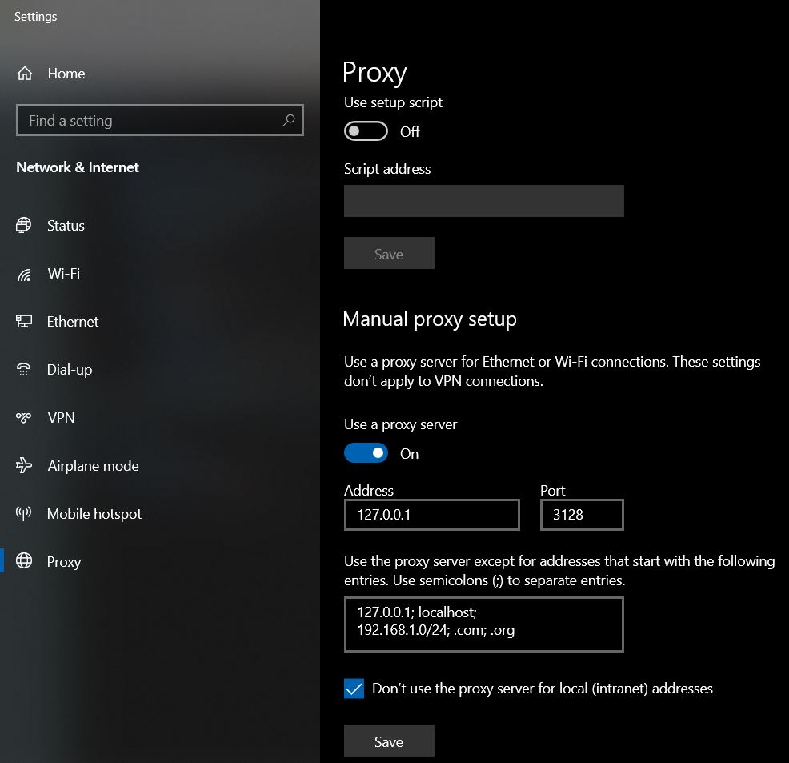

# Docker MulTSOCKS to HTTP and SOCKS5 chaining to SOCKS5 PROXY

It provides a way (as multiplatform as Docker is) to connect to a HTTP PROXY standard protocol 
to get to a SOCKS5 server with advanced route configuration, which is not readly provided 
by all softwares for free, like in Windows, which you can configure a simples HTTP proxy 
locally (see configuration at bottom). 

It can also be use in this case, for many applications, like some java implementations
that can connect to SOCKS but are not enabled to correctly pass the user and password
to authenticate SOCKS connection, so it can act as a SOCKS without authentiction chaining 
to an authenticated SOCKS.

References: 
[tsocks](http://manpages.ubuntu.com/manpages/bionic/man8/tsocks.8.html)
[ncat](http://manpages.ubuntu.com/manpages/bionic/en/man1/ncat.1.html)
[microsocks](https://github.com/rofl0r/microsocks)

Adjust the [tsocks.conf](http://manpages.ubuntu.com/manpages/bionic/man5/tsocks.conf.5.html) replacing the variables by your user name and password, 
and other configurations related to your SOCKS5 paths: 

```
default_user = user
default_pass = password
```

and check if the tsocks.conf is pointing to the correct path inside docker-compose.yml and run by using : 


```bash
docker-compose up 
```

```bash
docker run -v path/tsocks.conf:/etc/tsocks.conf -p 3128:3128 -p 1080:1080  greogoriomomm/microtsocks:latest 
```

Example: 

[Java](https://docs.oracle.com/javase/7/docs/technotes/guides/net/proxies.html): 
```
export JVM_ARGS='-Dhttp.proxyHost=localhost -Dhttp.proxyPort=3128 -Dhttp.nonProxyHosts="localhost|127.0.0.1|host.example.com"'
export JVM_ARGS='-DsocksProxyHost=localhost -DsocksProxyPort=1080'
```

Unix:
```bash
export http_proxy="http://127.0.0.1:3128"
export https_proxy="http://127.0.0.1:3128"
export no_proxy="127.0.0.1,localhost" 

curl http://host.target.domain
```

Or configure the Windows Proxy :


